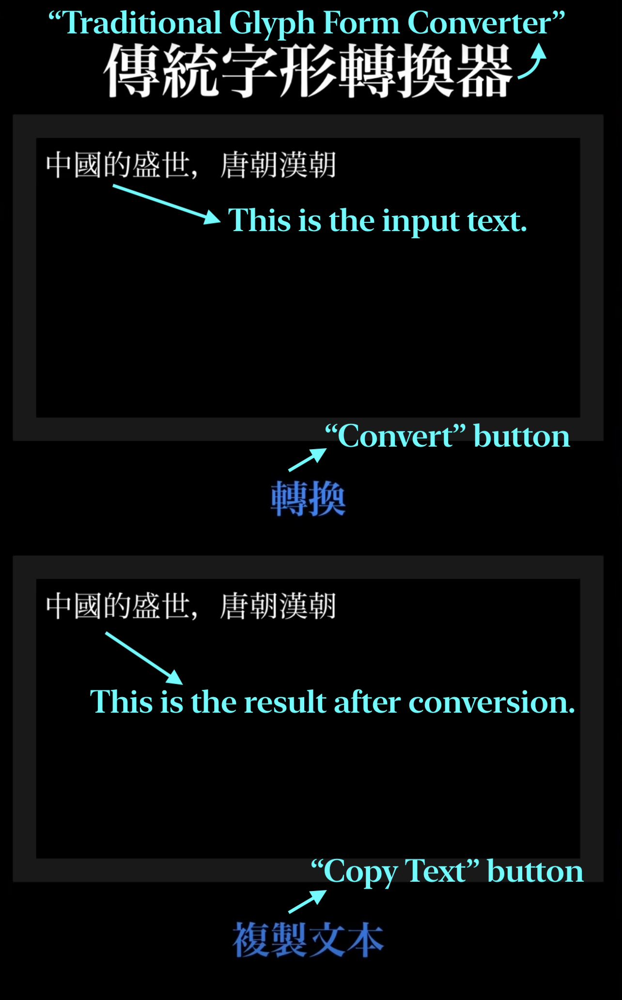
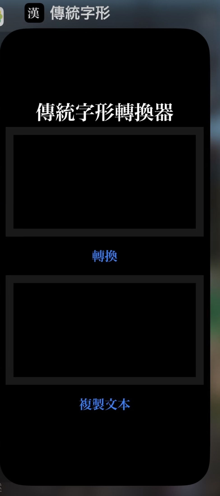

# Glyph Conversions
This is the code repository of an iOS app that converts Traditional Chinese Characters into Traditional Glyph Forms. This conversion can help to make sure texts that are in Traditional Chinese to show correctly on devices where the language is set to Japanese or Simplified Chinese, and customised fonts are not allowed. 
For more introductions, please see [here](https://github.com/LijiangnanTian/Traditional-Glyph-Forms), where you can also find its webapp. Note that this app is not submitted to App Store. 

This app is inspired by the app `Kyujitai` from [Emmanuel Ternon](https://github.com/DrTurnon/), which is aimed at the Japanese language.

## Demo
This is the layout of the app

